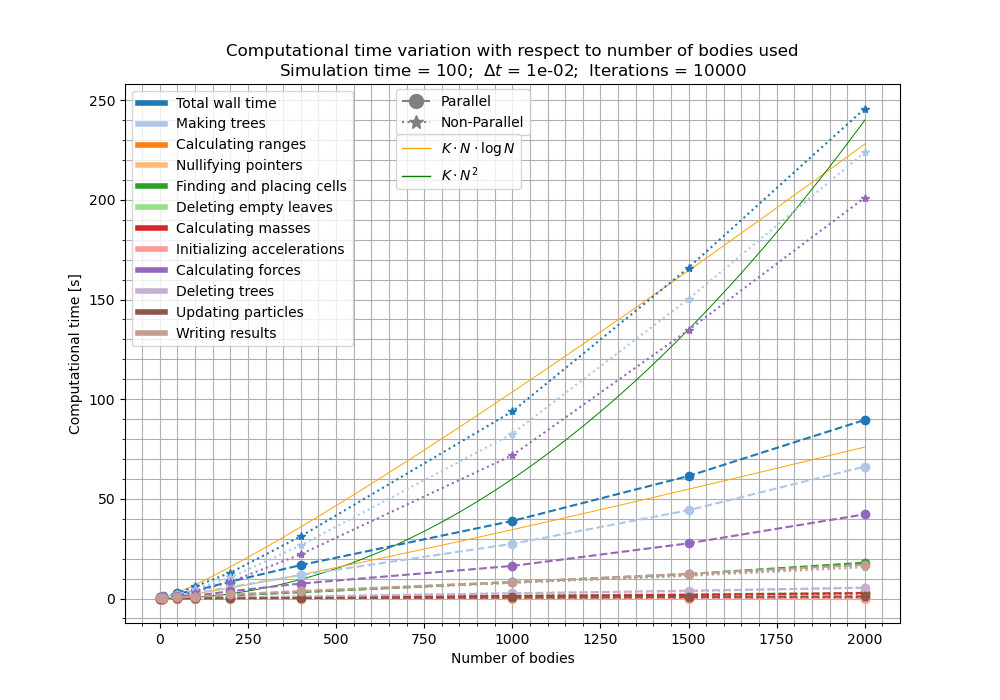

# Multithread Dynamical Simulation using Barnes-Hut and OpenMP, by Oscar Soler Pérez
Here is included the fortran code written to perform a multithread numerical integration of a system consisting of gravitationally interacting particles using the leapfrog integration method and Barnes-Hut algorithm.
The code has been inspired by the notes of the course Técnicas Avanzadas de Programación 2018-2019, Ángel de Vicente, pages 37-47 and pages 74-85.
It is possible to execute in serial and parallel mode.

> [!NOTE]
> All input parameters (such as timestep, initial conditions file name, gravitational softening or number of threads for parallel computing...) are defined in a `custom.par` file, required to execute the program. An extensive review of all files written and usage of the program is given below.

## Contains
- `src`: directory containing all source code: `.f90` files. Both for modules and subroutines and the main program.
  - `ex2.f90` is the main program.
  - `barnes-hut.f90` contains the Barnes-Hut module with the required subroutines to perform it.
  - `read_par.f90` contains the subroutine that reads the `custom.par` file and saves the defined parameters.
  - `init_conds.f90` defines a subroutine that creates a file with initial conditions of N particles at rest randomly distributed around a sphere with a given radius.
  - Different modules already used in the previous task:
    - `geometry.f90`
    - `particles.f90`
- `bin`: directory which stores all non-executable files. That is all `.o` and `.mod` files.
- `data`: directory with the different initial conditions that can be used.
  - `random_bodies.txt` contains the last initial conditions generated for N bodies at rest randomly distributed in a sphere.
  - `three_body.txt` contains the initial conditions used for three bodies in periodical orbits in ex1.
- `output`: directory which stores the different output files.
- `results`: directory with the different result images and animations created.
- `custom.par`: file in which all custom parameters (time-step, duration, number of particles, file names, ...) are set and can be changed. Can be automatically changed and generated by `python` script.
- `makefile`: used to create the executable. Can be combined with flag `OPENMP=yes/no` to decide wether to use parallel computing or not.
- `ex2`: executable program.
- `tools.py`: python script used to create figures and animations.


## Execution:  
After setting up the desired custom parameters in `custom.par`, type the following command \\
    `make OPENMP=yes/no`
    `ex2 custom.par`


## Output:
The results are stored in a `.txt` file wich contains in each line the total time of the snapshot and the coordinates of each body:
```
t1  x1 y1 z1 x2 y2 z2 x3 y3 z3 ... xN yN zN
t2  x1 y1 z1 x2 y2 z2 x3 y3 z3 ... xN yN zN
t3  x1 y1 z1 x2 y2 z2 x3 y3 z3 ... xN yN zN
...
tf  x1 y1 z1 x2 y2 z2 x3 y3 z3 ... xN yN zN
```


## Plotting:
Data can be represented with the `tools.py` script. Parameters can also be set there and simulations can be executed.
> [!CAUTION]
> You have to be certain to execute it with a `python` in the same environment in which your `gfortran` and `openmp` are. In my case it cannot execute parallel code because I have openmp installed outside of the environment...


## Results:
### Code behaviour
The code has proved its correct behaviour. Here are the results included in the `results` folder:
- `3body.mp4` is a video of the basic three body simulation with periodic orbits.
  - The same simulation for an extended amount of time is shown in `3body_simple.png`, in which the gravitational softening and `theta` value for center of mass usage were set as zero. It can be seen that the program mantains periodic orbits.
  - The same experiment is repeated in `3body_eps_theta.png` but with gravitational softening and theta=1. It can be seen that after many many periods the numerical error increases until the bodies loose their stable orbits.
- `5p_200t.mp4`, `10p_100t.mp4` and `1000p_200t.mp4` show animations for different situations with 5, 10 and 1000 particles respectively, while covering 200, 100 and 200 in time respectively.

### Time improvement by parallelization
The use of `openmp` to easily parallelize loops has proved quite useful in the acceleration of the computation time.
Figure `time_variation.png`, made with the script `time_analysis.py` shows the evolution of the computation time with respect to the number of bodies included for a fixed number of iterations.
The figure displays both the parallelized and non-parallelized computation times, while also dividing it in its components: time spent making trees (placing cells, removing empty leaves, calculating masses and forces and so on), time spent writing results or time spent updating parameters.



It can be seen that for a reasonable amount of bodies, the parallelized version of the code is much faster. The thin orange lines display the expected relationship between time and number of particles for a Barnes-Hut program ($\propto N\cdot \log N$). The expected computaitoinal time for a brute force approach can be compared in with the thin green line ($\propto N^2$).

Example of the prompting obtained when performing a simulation:
```
 Reading parameters from: custom.par
 ...
 Parameters loaded:
        dt    dt_out     t_end   epsilon     theta   create_bodies  N_bodies    radius
      0.01      1.00    100.00      0.01      1.00               T      2000     10.00
 
   -  input_file = data/random_bodies.txt
   -  output_file = output/output.txt
 
 - Parallelization: T
      -  N_threads =           12
 
Creating random initial conditions with 2000 bodies.
 Number of bodies read: 2000
 
 Input data saved to particle type variables.
 
 -------------------------------------------------------------
 Beginning of calculations
 -------------------------------------------------------------
 
 ...
 
 Progress: 100%
 -------------------------------------------------------------
 Calculations finished.        10000  iterations completed.
 -------------------------------------------------------------
 output/output.txt created.
Total wall time = 89.638 seconds.
  - Time spent in input setup = .025 seconds.
  - Time spent in main loop = 358.740 seconds.  (CPU time!!)
     - Makig trees = 66.214 seconds.
        - Calculating ranges = .341 seconds.
        - Nullifying pointers = .002 seconds.
        - Finding and placing cells = 17.957 seconds.
        - Deleting empty leaves = 2.835 seconds.
        - Calculating masses = 2.729 seconds.
        - Initializing accelerations = .075 seconds.
        - Calculating forces = 42.253 seconds.
     - Deleting trees = 5.373 seconds.
     - Updating particles = 1.074 seconds.
     - Writing results = 16.942 seconds.
 All time values for copying into python and plotting:
 89.64, 66.21,  0.34,  0.00, 17.96,  2.83,  2.73,  0.08, 42.25,  5.37,  1.07, 16.94
```
