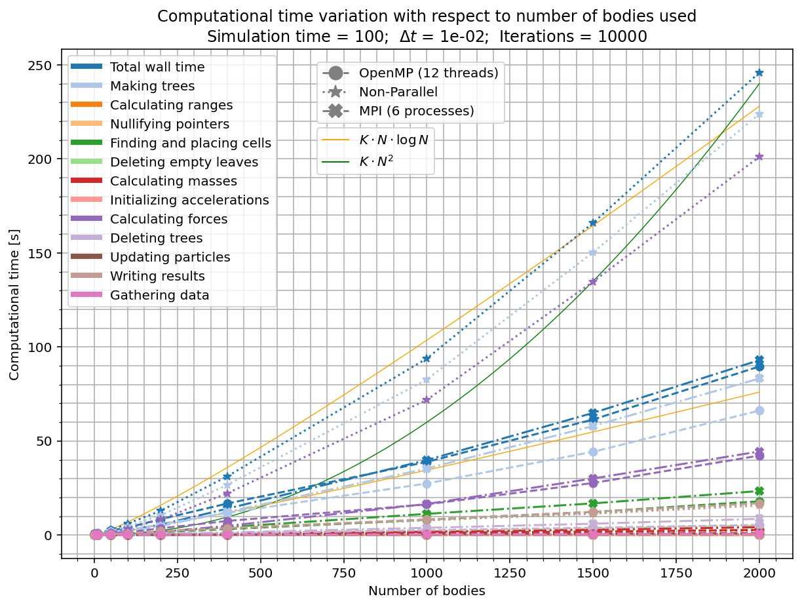

# Distributed Dynamical Simulation using Barnes-Hut and MPI, by Óscar Soler Pérez
Here is included the fortran code written to perform an MPI parallelized numerical integration of a system consisting of gravitationally interacting particles using the leapfrog integration method and Barnes-Hut algorithm.
The code has been inspired by the notes of the course Técnicas Avanzadas de Programación 2018-2019, Ángel de Vicente, pages 37-47 and pages 74-85.

##MPI parallelization
After examining the results obtained in exercise 2, it was observed that the main source of time consumption was the calculation of forces. All other steps were much faster. It was decided to distribute that work with MPI.
The parallelization strategy chosen uses the main process for reading input data and creating initial conditions. Particle information is broadcasted to all processes and they all build the tree. Then, each process calculates the forces and updates the velocities of only a subset of particles, and at the end of each iteration information is gathered.

> [!NOTE]
> All input parameters (such as timestep, initial conditions file name, gravitational softening...) are defined in a `custom.par` file, required to execute the program. An extensive review of all files written and usage of the program is given below.

## Contains
- `src`: directory containing all source code: `.f90` files. Both for modules and subroutines and the main program.
  - `ex3.f90` is the main program.
  - `barnes-hut.f90` contains the Barnes-Hut module with the required subroutines to perform it.
  - `read_par.f90` contains the subroutine that reads the `custom.par` file and saves the defined parameters.
  - `init_conds.f90` defines a subroutine that creates a file with initial conditions of N particles at rest randomly distributed around a sphere with a given radius.
  - Different modules already used in the previous task:
    - `geometry.f90`
    - `particles.f90`. An MPI Datatype for the particles was added here.
- `bin`: directory which stores all non-executable files. That is all `.o` and `.mod` files.
- `data`: directory with the different initial conditions that can be used.
  - `random_bodies.txt` contains the last initial conditions generated for N bodies at rest randomly distributed in a sphere.
  - `three_body.txt` contains the initial conditions used for three bodies in periodical orbits in ex1.
- `output`: directory which stores the different output files.
- `results`: directory with the different result images and animations created.
- `custom.par`: file in which all custom parameters (time-step, duration, number of particles, file names, ...) are set and can be changed. Can be automatically changed and generated by `python` script.
- `makefile`: used to create the executable.
- `ex3`: executable program.
- `tools.py`: python script used to create figures and animations.
- `time_analysis.py`: python script used to study the time taken to perform different simulations.


## Execution:  
After setting up the desired custom parameters in `custom.par`, type the following command \\
    `make`
    `mpirun -n 6 ex3 custom.par`
Where 6 is the number of processes desired for parallelization.


## Output:
The results are stored in a `.txt` file wich contains in each line the total time of the snapshot and the coordinates of each body:
```
t1  x1 y1 z1 x2 y2 z2 x3 y3 z3 ... xN yN zN
t2  x1 y1 z1 x2 y2 z2 x3 y3 z3 ... xN yN zN
t3  x1 y1 z1 x2 y2 z2 x3 y3 z3 ... xN yN zN
...
tf  x1 y1 z1 x2 y2 z2 x3 y3 z3 ... xN yN zN
```


## Plotting:
Data can be represented with the `tools.py` script. Parameters can also be set there and simulations can be executed.
> [!CAUTION]
> You have to be certain to execute it with a `python` in the same environment in which your `gfortran` and `openmp` are. In my case it cannot execute parallel code because I have openmp installed outside of the environment...


## Results:
### Code behaviour
The code has proved its correct behaviour. Here are the results included in the `results` folder:
- `three_body.mp4` is a video of the basic three body simulation with periodic orbits.
- `n_2000.mp4` shows an animation with 2000 particles.

### Time improvement by parallelization
The use of `mpi` to parallelize the code has proved efficient in the acceleration of the computation time.
Figure `time_variation.png`, made with the script `time_analysis.py` shows the evolution of the computation time with respect to the number of bodies included for a fixed number of iterations.
The figure displays both the parallelized (with OpenMP and with MPI) and non-parallelized computation times, while also dividing it in its components: time spent making trees (placing cells, removing empty leaves, calculating masses and forces and so on), time spent writing results, time spent updating parameters and time spent communicating among different processes.

The MPI parallelization used is as fast as the code with OpenMP of exercise 2. This is due to parallelizing the same section of code (force calculations) and nothing else. A more complex parallelization in which the whole tree is not made and used by all processes may be able to accelerate the code even more, but it would have taken too much time to write.




Example of the prompting obtained when performing a simulation:
```
 Reading parameters from: custom.par
 ...
 Parameters loaded:
        dt    dt_out     t_end   epsilon     theta   create_bodies  N_bodies    radius
      0.01      1.00    100.00      0.01      1.00               T      2000     10.00
 
   -  input_file = data/random_bodies.txt
   -  output_file = output/output.txt
 
 - Parallelization: T
      -  N_threads =            6
 
Creating random initial conditions with 2000 bodies.
 Number of bodies read: 2000
 
 Input data saved to particle type variables.
  Broadcasting data to all processes...
 
 -------------------------------------------------------------
 Beginning of calculations
 -------------------------------------------------------------
 
 ...
 
 Progress: 100%
 -------------------------------------------------------------
 Calculations finished.        10000  iterations completed.
 -------------------------------------------------------------
 output/output.txt created.
Total wall time = 93.014 seconds.
  - Time spent in input setup = .017 seconds.
     - Time broadcasting initial values = .017 seconds.
  - Time spent in main loop = 92.998 seconds.
     - Makig trees = 83.259 seconds.
        - Calculating ranges = .401 seconds.
        - Nullifying pointers = .002 seconds.
        - Finding and placing cells = 23.425 seconds.
        - Deleting empty leaves = 5.055 seconds.
        - Calculating masses = 4.202 seconds.
        - Initializing accelerations = .091 seconds.
        - Calculating forces = 44.454 seconds.
        - Gathering process information = .649 seconds.
     - Deleting trees = 8.658 seconds.
     - Updating particles = .198 seconds.
     - Writing results = .213 seconds.
 All time values for copying into python and plotting:
 93.01, 83.26,  0.40,  0.00, 23.42,  5.06,  4.20,  0.09, 44.45,  8.66,  0.20,  0.21,  0.65
```
